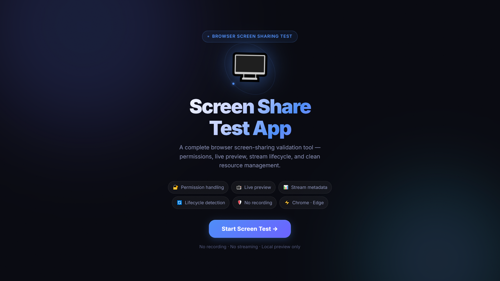
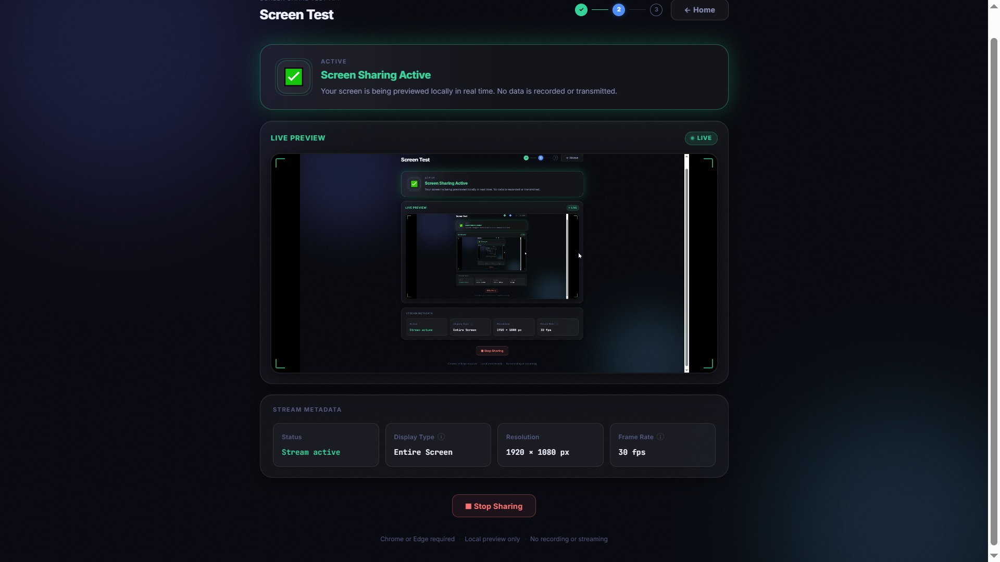

# Screen Share Test App

A premium, glassmorphism-themed React (Vite) application that demonstrates and validates browser screen-sharing capabilities, media stream lifecycle management, and robust error handling — using **native Web APIs only**, with zero third-party libraries.

---

## 🌍 Live Demo

🔗 **[https://screen-share-test-app.onrender.com/](https://screen-share-test-app.onrender.com/)**

---

## 🚀 Features

- **Browser Capability Check** — Verifies `navigator.mediaDevices.getDisplayMedia` support before navigation; shows an unsupported-browser notice on incompatible browsers.
- **6 Distinct Permission States** — Each is shown in the UI with a unique message: `idle`, `requesting`, `granted`, `cancelled`, `denied`, `ended`.
- **Live Local Preview** — Streams the captured display to a `<video>` element in real time. No recording, no backend.
- **Stream Metadata** — Reads `displaySurface`, `width`, `height`, and `frameRate` directly from `videoTrack.getSettings()`.
- **Lifecycle Detection** — Attaches `track.onended` to detect when the user stops sharing from the browser toolbar or when the OS terminates the stream.
- **Zero Track Leaks** — Guaranteed cleanup on manual stop, retry, and component unmount via `useEffect`.
- **Custom Hook** — All screen-sharing logic is isolated in `useScreenShare`.
- **Reusable Components** — `Button`, `LoadingSpinner`, `UnsupportedBrowser`.

---

## 📦 Setup Instructions

### Prerequisites
- [Node.js](https://nodejs.org/) v16 or higher
- npm (bundled with Node.js)

### Installation & Run

```bash
# 1. Navigate to the project directory
cd screen-sharing

# 2. Install dependencies
npm install

# 3. Start the development server
npm run dev
```

Open your browser at `http://localhost:5173`.

> **Note:** Screen sharing requires a **Secure Context** — `localhost` counts as secure. Hosting on plain HTTP will fail.

---

## 🛠 Screen-Sharing Flow Explanation

### Step 1 — API Capability Check (Homepage)
At module load time, `Home.jsx` checks:

```js
navigator.mediaDevices && typeof navigator.mediaDevices.getDisplayMedia === 'function'
```

If unsupported, the `UnsupportedBrowser` component is shown **in place of the Start button** — no navigation occurs.

### Step 2 — Permission Request (`useScreenShare`)
On "Start Screen Test" click, `startScreenShare()` is called:

```js
navigator.mediaDevices.getDisplayMedia({
  video: { frameRate: { ideal: 30 } },
  audio: false,
})
```

Status is immediately set to `requesting` (disables button, shows loading indicator).

### Step 3 — Error State Classification
The `catch` block maps browser errors to distinct UI states:

| Error Name | Cause | UI State |
|---|---|---|
| `AbortError` | User cancelled the picker | `cancelled` |
| `NotAllowedError` + message "permission denied" | OS/browser hard block | `denied` |
| `NotAllowedError` + other message | Picker dismissed (older Chrome) | `cancelled` |
| `NotFoundError` | No capture source exists | `error` |
| `InvalidStateError` | Not HTTPS / document inactive | `error` |
| `TypeError` | Bad constraints | `error` |
| Everything else | Unknown | `error` |

### Step 4 — Stream Active & Metadata
On success:
- The `MediaStream` is stored in a `ref` (for lifecycle closure) and `state` (for rendering).
- `videoTrack.getSettings()` is called immediately to read `displaySurface`, `width`, `height`, `frameRate`.
- `displaySurface` is mapped: `browser` → `"Browser Tab"`, `window` → `"Application Window"`, `monitor` → `"Entire Screen"`.

### Step 5 — Lifecycle Detection
```js
videoTrack.onended = () => {
  setStatus('ended');
  // stop all tracks, clear streamRef
};
```

`onended` fires when the user clicks the browser's **"Stop sharing"** button or when the OS terminates the stream. The UI updates immediately and shows **Retry** and **Back to Home** buttons.

### Step 6 — Retry (No Leaks)
```js
cleanup();                             // clears streamRef + state
queueMicrotask(() => startScreenShare()); // opens fresh picker
```

`cleanup()` nulls `streamRef.current` synchronously, so the new `startScreenShare()` call sees a clean slate and no old tracks leak.

### Step 7 — Unmount Cleanup
```js
useEffect(() => () => {
  streamRef.current?.getTracks().forEach(t => { t.onended = null; t.stop(); });
}, []);
```

Ensures media tracks are released if the user navigates away while a stream is active.

---

## 📸 Screenshots

### Homepage


*Static homepage with capability check — shows "Start Screen Test" button or unsupported-browser notice.*

### Screen Test — Active


*Active screen share: live preview, stream metadata (display type, resolution, frame rate), and Stop Sharing button.*

---

## 🌐 Known Limitations & Browser Quirks

| Issue | Details |
|---|---|
| **`displaySurface` not always available** | Chrome and Edge expose this correctly. Firefox may return `undefined`, which the app maps to `"Unknown"`. |
| **`NotAllowedError` ambiguity** | In Chrome ≥ 107 the picker cancel throws `NotAllowedError` (same as permission denied) — the app distinguishes them by inspecting `err.message`. In very old Chrome, `AbortError` is used instead. |
| **Frame rate may be `null`** | Some browsers omit `frameRate` from `getSettings()` (e.g. when sharing a static window). The UI shows `"—"` in this case. |
| **No mobile support** | `getDisplayMedia` is not supported on iOS Safari or most Android browsers by design. The app shows the unsupported-browser notice. |
| **Secure Context required** | Screen sharing only works on `localhost` or HTTPS. Plain HTTP origins will throw `InvalidStateError`. |
| **macOS privacy restrictions** | On macOS, system-level Screen Recording permission must be granted to the browser in **System Preferences → Privacy & Security → Screen Recording**. |
| **Firefox audio not requested** | This app passes `audio: false`, so no audio track is ever requested — this is intentional per the spec. |

---

## 🧱 Architecture

```
src/
├── hooks/
│   └── useScreenShare.js     # All screen-sharing logic (custom hook)
├── components/
│   ├── Button.jsx             # Reusable button (primary/secondary/danger, loading state)
│   ├── LoadingSpinner.jsx     # CSS ring spinner
│   └── UnsupportedBrowser.jsx # Shown when API is unavailable
├── pages/
│   ├── Home.jsx               # Route: / — capability check + Start button
│   └── ScreenTest.jsx         # Route: /screen-test — full test flow
├── index.css                  # All styles (plain CSS, glassmorphism theme)
└── App.jsx                    # Router setup
```

## 📜 License
This project is for demonstration and evaluation purposes only.
